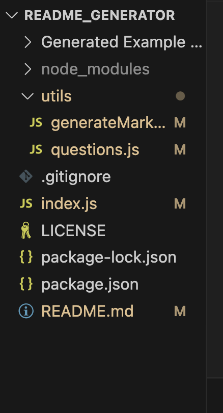
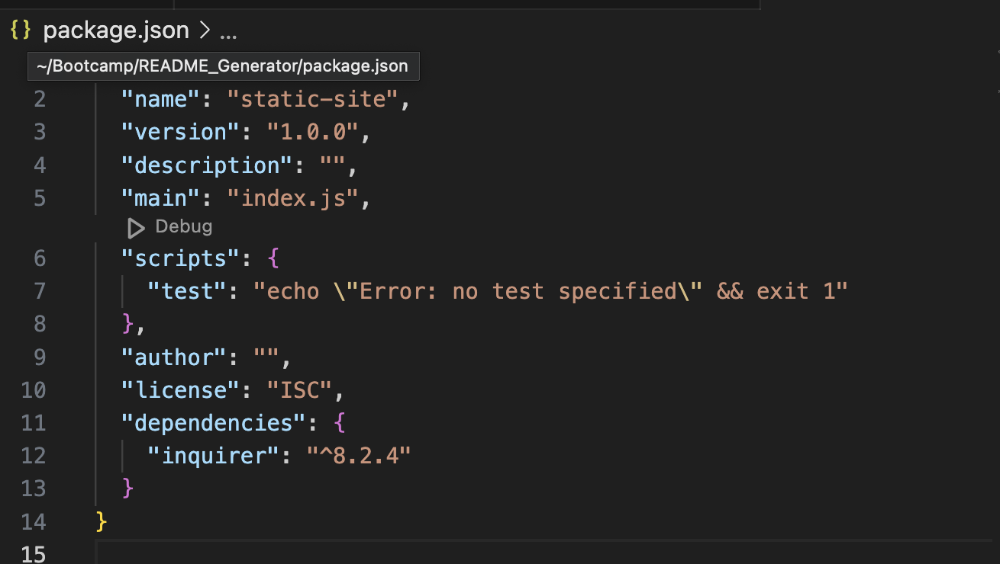

# README Generator

  ## Description
    
  Using node.js and installed inquirer, a preformatted README is generated by answering a few questions in the terminal.  Once all questions are answered, a new README file will be made, where edits to the text can be made as needed. 

----------------------
  ## Table of Contents 
  
  - [Description](#description)
  - [Installation](#installation)
  - [Usage](#usage)
  - [Credits](#credits)
  - [License](#license)
  - [Tests](#tests)
  - [Contributing](#contributing)
  - [Questions](#questions)

---------------------- 
  ## Installation
  Make sure to have node installed.  Then you will be able to do an `npm install inquirer@8.2.4` in order for the program to run correctly.
  1. Clone the repo
  2. Open the terminal and open folder with code
  3. In terminal `npm init -y`
  4. In terminal `npm install inquirer@8.2.4`
  5. Now you can run the program with `node index.js`
  
*[Inquirer package](https://www.npmjs.com/package/inquirer/v/8.2.4).

*[Node Documentation](https://nodejs.org/en/docs)

Here is an example of how your files should look once you have everything installed: 

In package.json, check under dependencies that inquirer is listed: 

----------------------
  ## Usage
  You can use this project to generate READMEs for all your Github projects 

  Watch this [video](https://drive.google.com/file/d/1Xx57xalPZYjKDVjfekvzm6p2Aop0U69C/view) to learn how to use the program

----------------------
  ## Credits
  
  My tutor Alex Gonzolaz and BCS helped me with a few issues I had with my code.
  

----------------------
  ## License
  
  This project is covered by the MIT license.  Please refer to the license documentation for further information
  

----------------------
  ## Tests
  
  NA
  

----------------------
  ## Contributing
  
  To contribute to this application, create a pull request.
  Here are the steps:
  1. Fork the repo
  2. Create a feature branch (git checkout -b NAME-HERE)
  3. Commit your new feature (git commit -m 'Add some feature')
  4. Push your branch (git push)
  5. Create a new Pull Request

  Your code will be reviewed and merged.
  
-----------------------
  ## Questions

  Name: Pamela Agrast 
  Repository: https://github.com/agrastp/README_Generator 
  Clone: git@github.com:agrastp/README_Generator.git 
  E-mail: agrastp@yahoo.com
  
  
